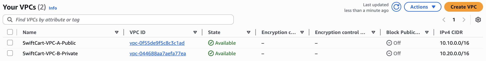
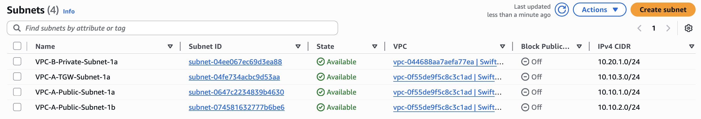
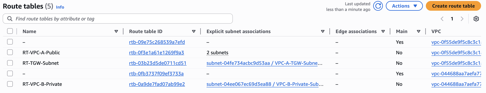
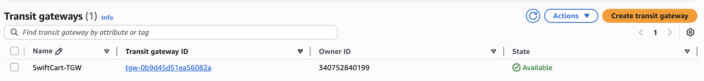
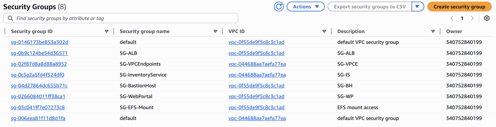
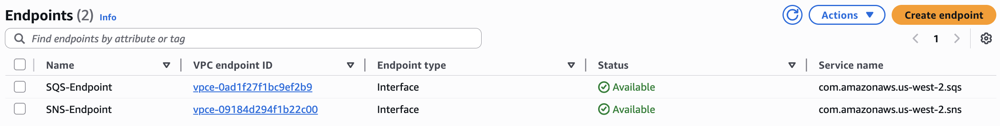

# Networking & Zero-Trust Backbone

The foundation of SwiftCart is a strict network isolation model. Instead of a
single flat network with a hardened perimeter, the system assumes breach and
splits infrastructure into two VPCs with controlled, auditable paths between
them.

## The two VPCs

| VPC | Role | CIDR | Internet |
|-----|------|------|----------|
| `SwiftCart-VPC-A-Public` | Public / DMZ — Web Portal, Bastion, ALB | `10.10.0.0/16` | IGW + NAT |
| `SwiftCart-VPC-B-Private` | Dark / Private — Inventory microservice | `10.20.0.0/16` | None (dark) |

VPC B is a **dark network**: no Internet Gateway, no NAT Gateway, no public
egress at all. Both VPCs have DNS resolution and DNS hostnames enabled so that
interface VPC endpoints resolve correctly.



## Subnets

| Subnet | VPC | AZ | CIDR | Purpose |
|--------|-----|----|----|---------|
| `VPC-A-Public-Subnet-1a` | A | us-west-2a | `10.10.1.0/24` | Web Portal, Bastion |
| `VPC-A-Public-Subnet-1b` | A | us-west-2b | `10.10.2.0/24` | ALB cross-AZ HA |
| `VPC-A-TGW-Subnet-1a` | A | us-west-2a | `10.10.3.0/24` | Transit Gateway attachment |
| `VPC-B-Private-Subnet-1a` | B | us-west-2a | `10.20.1.0/24` | Inventory service |



## Routing

The Transit Gateway (`SwiftCart-TGW`) is the single controlled path between the
two VPCs. Routing is deliberately asymmetric to keep VPC B dark:

- **RT-VPC-A-Public** → `0.0.0.0/0` to IGW; `10.20.0.0/16` to TGW
- **RT-TGW-Subnet** → `0.0.0.0/0` to NAT
- **RT-VPC-B-Private** → `0.0.0.0/0` to TGW (no IGW exists, so this can never
  reach the internet — only the synchronous read path back to VPC A)




## Zero-Trust Security Groups

Security groups reference each other rather than CIDR ranges wherever possible,
so access is identity-scoped, not location-scoped.

| Security Group | VPC | Inbound |
|----------------|-----|---------|
| `SG-BastionHost` | A | TCP 22 from my IP only |
| `SG-WebPortal` | A | TCP 80 from `SG-ALB`; TCP 22 from `SG-BastionHost` |
| `SG-ALB` | A | TCP 80 from `0.0.0.0/0` |
| `SG-InventoryService` | B | TCP 5000 from `10.10.0.0/16`; TCP 22 from `SG-BastionHost` |
| `SG-VPCEndpoints` | B | TCP 443 from `10.20.0.0/16` and `10.10.0.0/16` |
| `SG-EFS-Mount` | A | NFS 2049 from `SG-WebPortal` |



## PrivateLink (VPC Interface Endpoints)

Because VPC B is dark, it cannot reach the public AWS API endpoints for SNS or
SQS. AWS PrivateLink injects Elastic Network Interfaces for those services
directly into VPC B's private subnet. API calls travel the internal AWS
backbone — the public internet is removed from the attack surface entirely.

- `SQS-Endpoint` → `com.amazonaws.us-west-2.sqs` (Interface)
- `SNS-Endpoint` → `com.amazonaws.us-west-2.sns` (Interface)

Both have **Enable DNS name** turned on so the default service hostnames
resolve to the private ENI addresses.



## Identity as the perimeter (IAM)

No long-lived access keys exist anywhere. EC2 instances assume IAM roles via
instance profiles, and credentials are rotated automatically by the instance
metadata service.

| Role | Attached to | Grants |
|------|-------------|--------|
| `SwiftCart-WebPortal-Role` | Web Portal EC2 | SNS publish, SQS access |
| `SwiftCart-Inventory-Role` | Inventory EC2 | SQS access |
| `SwiftCart-ServerlessProcessor-Role` | Lambda | SQS receive/delete + CloudWatch Logs |

## Administrative access

Internal instances are never exposed. SSH to the dark VPC is done by jumping
through the bastion:

```bash
ssh -J ec2-user@<BASTION_PUBLIC_IP> ec2-user@<INVENTORY_PRIVATE_IP>
```
