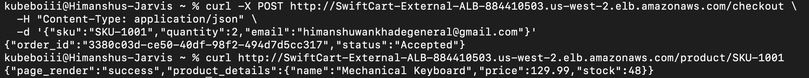

# Application Layer: CQRS & Messaging Federation

SwiftCart separates **reads** and **writes** into two fundamentally different
paths — Command Query Responsibility Segregation (CQRS) — and decouples writes
through an SNS → SQS fan-out.

## The synchronous read path (CQRS — Query)

A product page view needs an immediate answer. The Web Portal in VPC A makes a
direct HTTP `GET` to the Inventory Service in VPC B over the Transit Gateway:

```
User → ALB → Web Portal (VPC A) → [TGW] → Inventory Service (VPC B) :5000
```

The Web Portal uses a 2-second timeout so a slow or unreachable backend fails
fast instead of cascading.

- `GET /product/<sku>` (Web Portal) → `GET /api/v1/inventory/<sku>` (Inventory)

## The asynchronous write path (CQRS — Command)

A checkout is a mutation. Writing synchronously would couple the Web Portal to
the inventory database and create cascading failure risk. Instead the Web
Portal publishes an event to SNS and immediately returns `202 Accepted`:

```
User → ALB → Web Portal → SNS topic ──► Email subscriber (customer confirmation)
                                   └──► SQS queue ──► consumer (EC2 thread, later Lambda)
```

The customer gets an instant acknowledgement; the actual stock deduction
happens asynchronously and is **eventually consistent**.

## Messaging federation (SNS fan-out to SQS)

A single `publish` reaches two independent subscribers:

| Component | Name | Role |
|-----------|------|------|
| SNS topic | `SwiftCart-Order-Fanout` | Event router |
| Email subscription | (your address) | Immediate customer notification |
| SQS queue | `OrderProcessingQueue` | Durable buffer for the consumer |

SQS acts as a shock absorber: if the consumer is slow or down, queue depth
grows but no orders are lost and the Web Portal is unaffected. The SQS access
policy (`src/scripts/sqs-access-policy.json`) allows only the specific SNS
topic ARN to write to the queue.

The SNS envelope wraps the order payload, so consumers parse twice:

```python
sns_envelope = json.loads(body)
order_data   = json.loads(sns_envelope['Message'])
```

## Code

| File | Runs on | Purpose |
|------|---------|---------|
| `src/web-portal/web_portal_ec2.py` | VPC A EC2 | Front-end API (non-containerized reference) |
| `src/web-portal/web_portal.py` | VPC A (Docker) | 12-factor containerized front-end |
| `src/inventory-service/inventory_service.py` | VPC B EC2 | Flask read API + SQS consumer thread |

## Validation

Both CQRS paths were exercised end-to-end against the ALB DNS name:

```bash
# Synchronous read
curl http://<ALB_DNS>/product/SKU-1001
# → {"page_render":"success","product_details":{"name":"Mechanical Keyboard","price":129.99,"stock":48}}

# Asynchronous write
curl -X POST http://<ALB_DNS>/checkout \
  -H "Content-Type: application/json" \
  -d '{"sku":"SKU-1001","quantity":2,"email":"test@example.com"}'
# → {"order_id":"3380c03d-ce50-40df-98f2-494d7d5cc317","status":"Accepted"}
```

The read returned `stock: 48` — proving an earlier checkout of 2 units was
processed asynchronously and the state converged (50 → 48).


