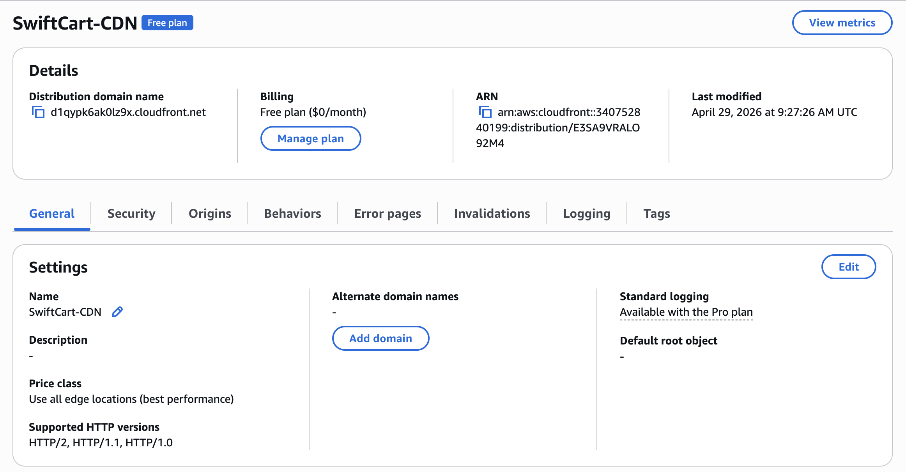
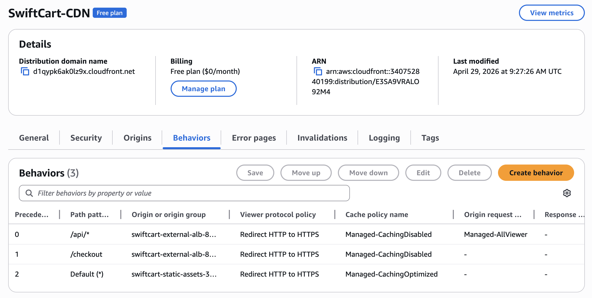
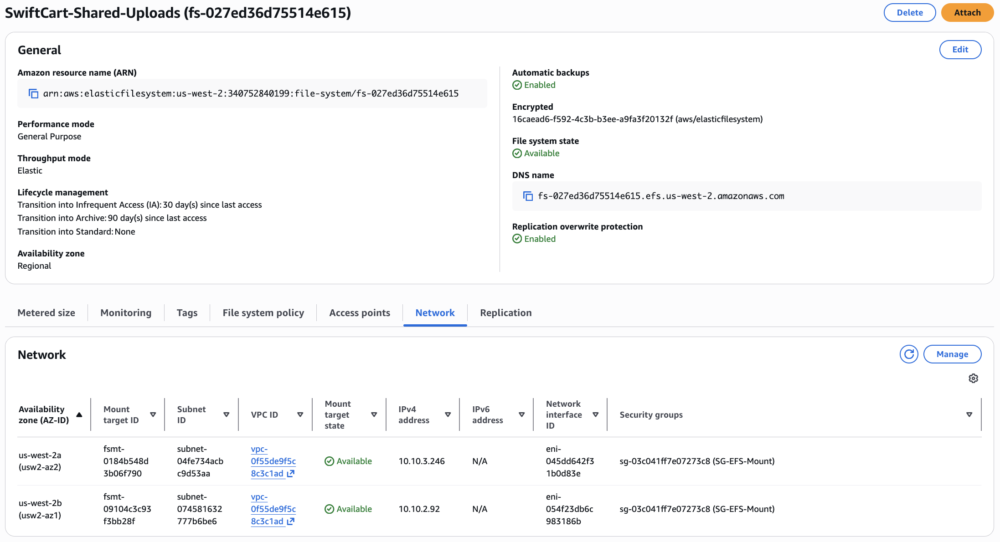

# Edge Delivery & Persistent Storage

This layer puts a single global domain in front of everything and gives each
tier the right kind of disk.

## Unified CloudFront distribution (multi-origin)

`SwiftCart-CDN` is a Layer 7 router with two origins:

| Behavior (path) | Origin | Cache policy | Why |
|-----------------|--------|--------------|-----|
| `Default (*)` | S3 static bucket | `CachingOptimized` | HTML/CSS cached hard at the edge |
| `/api/*` | ALB | `CachingDisabled` + `AllViewer` | Dynamic, never cached |
| `/checkout` | ALB | `CachingDisabled` + `AllViewer` | Dynamic, never cached |

The S3 bucket has **Block all public access** on. CloudFront reads it through
an Origin Access Control (`SwiftCart-OAC`); the bucket policy grants access
only to the distribution. The bucket is never publicly reachable.




### Validation

```bash
curl https://<dist>.cloudfront.net/index.html              # → S3 content
curl https://<dist>.cloudfront.net/api/v1/inventory/SKU-1001  # → JSON from VPC B
```

The second call proves a request travels: CloudFront → ALB → VPC A → TGW →
VPC B, with the cache bypassed.

## EFS — shared network drive (Web tier)

The Web Portal can run on multiple instances behind the ALB. A file uploaded
to one instance must be visible from the others, so all Web Portal instances
mount a single shared `SwiftCart-Shared-Uploads` EFS file system (NFSv4.1,
Multi-AZ) at `/var/www/swiftcart/shared_uploads`.

- Mount targets (ENIs) in each public subnet AZ
- `SG-EFS-Mount` allows NFS (2049) only from `SG-WebPortal`
- Persisted via `/etc/fstab` so it survives reboots

Setup script: `src/scripts/mount-efs.sh`



## EBS — high-speed local drive (Inventory tier)

The Inventory Service needs fast local I/O that doesn't contend with the OS
root volume, so it gets a dedicated `gp3` SSD volume:

- gp3, 3000 IOPS baseline, 125 MB/s, same AZ as the instance
- Formatted **XFS** (good for high-throughput DB-style workloads)
- Mounted at `/mnt/inventory_cache`, persisted by UUID in `/etc/fstab`

Setup script: `src/scripts/format-mount-ebs.sh`

### EFS vs EBS

| | EFS | EBS |
|--|-----|-----|
| Type | Network file system (NFS) | Block device |
| Sharing | Many instances at once | One instance |
| Scope | Multi-AZ | Single AZ |
| Use here | Shared web uploads | Inventory cache |
