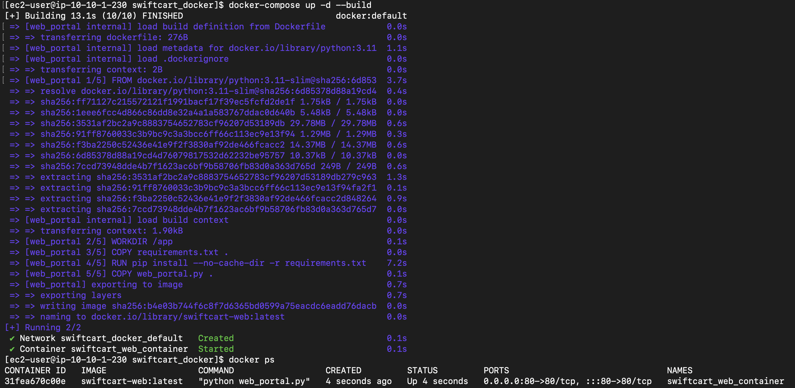
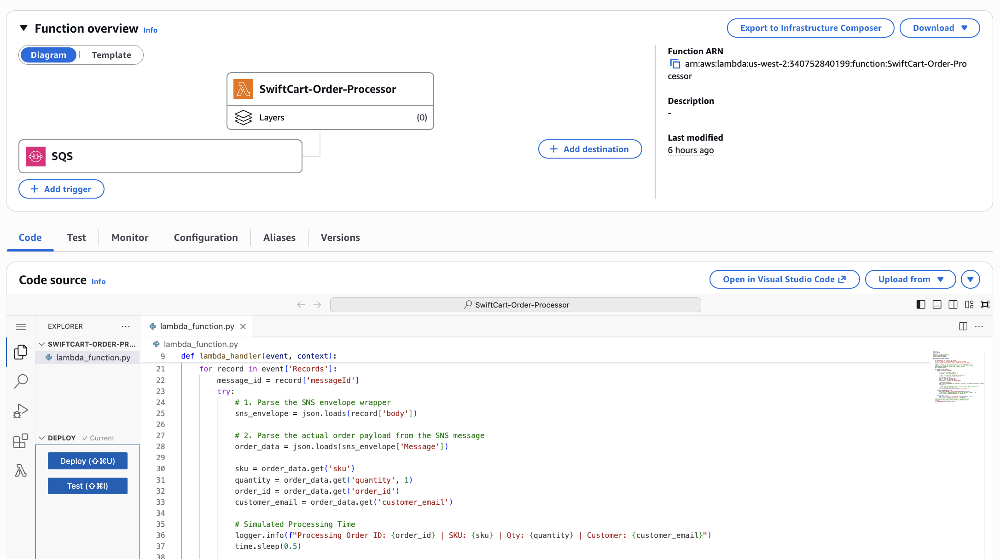
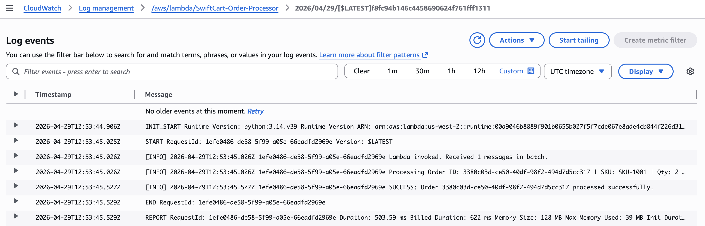

# Serverless Modernization & Observability

The final layer removes always-on polling compute and adds the monitoring and
auditing needed to actually operate the system.

## Containerized, immutable web tier

The Web Portal stops running as a bare process on the OS ("pet") and becomes a
Docker container ("cattle"). The application reads all configuration from
environment variables (12-factor), so the same image runs anywhere.

Artifacts (`src/web-portal/`):

- `web_portal.py` — env-driven Flask app
- `requirements.txt` — pinned dependencies
- `Dockerfile` — `python:3.11-slim`, installs deps, exposes port 80
- `docker-compose.yml` — port mapping, env vars, and a read-only mount of
  `~/.aws` so boto3 inside the container uses the EC2 instance profile

Deploy:

```bash
sudo pkill -f web_portal.py        # stop the old bare process if present
docker-compose up -d --build
docker ps                          # swiftcart_web_container should be Up
```



## Serverless event-driven compute (AWS Lambda)

The EC2 background thread that long-polled SQS in an infinite loop is replaced
by `SwiftCart-Order-Processor`, a Lambda function:

- Runtime Python 3.12, **arm64 / Graviton** (faster & cheaper)
- Execution role `SwiftCart-ServerlessProcessor-Role`
- Triggered by an **SQS Event Source Mapping**, batch size 10 — AWS polls the
  queue for us; the function only runs when work exists and scales out
  automatically
- Returns `batchItemFailures` for **partial-batch retry**: good messages are
  deleted, poison messages become visible again (and eventually go to a DLQ)

Code: `src/lambda/lambda_function.py`



This is a clean efficiency win: no idle CPU paid for when there are zero
orders, no single-thread bottleneck when there are thousands. (In production
the handler would write to DynamoDB/RDS rather than an in-memory structure,
since Lambda is stateless.)

## Observability & auditing

**CloudWatch Logs** — every Lambda invocation logs to
`/aws/lambda/SwiftCart-Order-Processor`. A real checkout produced this trace,
with the order ID matching the `202` response from the checkout call:

```
[INFO] Lambda invoked. Received 1 messages in batch.
[INFO] Processing Order ID: 3380c03d-ce50-40df-98f2-494d7d5cc317 | SKU: SKU-1001 | Qty: 2
[INFO] SUCCESS: Order 3380c03d-ce50-40df-98f2-494d7d5cc317 processed successfully.
```



**CloudWatch Alarm** — `SQS-Queue-Depth-Critical` watches
`ApproximateNumberOfMessagesVisible` on `OrderProcessingQueue`. If it stays
≥ 100 (consumers falling behind), it notifies the `SwiftCart-SRE-Alerts` SNS
topic by email.

**CloudTrail** — `SwiftCart-Management-Audit` records every management-plane
API call (who, what, when, from where) to an S3 bucket. This answers
questions like "who deleted the SQS event source mapping" conclusively.

## SRE troubleshooting reference

| Symptom | First checks |
|---------|--------------|
| SQS depth alarm fires | Lambda Monitor tab → Errors/Throttles. `AccessDeniedException` = missing IAM perms. `Task timed out` = raise timeout. Throttles = concurrency limit. |
| Container CrashLoopBackOff / ALB 502 | `docker logs swiftcart_web_container`. `Errno 98 address in use` = old bare process still on :80. `NoCredentialsError` = `~/.aws` volume mapping wrong. |
| Untraceable infra change | CloudTrail → Event history, filter by event name (e.g. `DeleteEventSourceMapping`), read the user/IP. |
